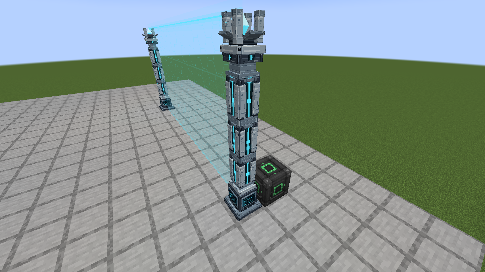

# Field Emitters

Terrain-following forcefields for Minecraft. Place Field Emitter posts around an area and they link up into a five-block-high perimeter that follows the ground between them. Mount Field Rails on walls, floors and ceilings to seal doorways, pits and shafts. Every field decides what passes through it, reports what crossed it, and runs on Forge Energy.

[Download](https://www.curseforge.com/minecraft/mc-mods/field-emitters) · [Wiki](https://github.com/shikyo13/Field-Emitters/tree/main/docs/wiki) · [Issues](https://github.com/shikyo13/Field-Emitters/issues) · [Discord](https://discord.gg/NrdXnbWzGC)



## Features

- Emitter posts link to other posts up to 20 blocks away in the four cardinal directions and project a field that climbs and descends with the terrain.
- Rails mount on any block face, span up to 20 blocks to an opposing rail, and join side by side into one wall, floor or ceiling.
- Blocking filters by category: hostile, passive, players, dropped items and other entities. Narrow a filter with age, entity type or tag, item, UUID or scoreboard tag, choose the movement directions it applies to, invert it, and exempt the owner.
- Detection output on a redstone face: one pulse per completed crossing, or a steady signal while a matching entity touches the field. Counts dropped items per stack or per item.
- Separate rules for each link, redstone enable modes, six color presets or any hex color, an animated field pattern, and optional block light.
- A handheld Field Tuner that opens controls, manages every loaded field from anywhere in the dimension, samples mobs and players for filters, and cycles colors.
- Forge Energy input on every emitter and rail from any energy mod. Connected emitters pool their stored energy.

## Getting started

1. Craft a Field Emitter with copper, an amethyst shard, glass, a block of redstone and iron. Craft a Field Tuner with an amethyst shard, copper, a glass pane, iron and redstone.
2. Place emitters on level ground in a rectangle or a line, up to 20 blocks apart. A post needs five free blocks of height.
3. Feed energy into any post from a cable or generator. Connected posts share power, so one input runs the whole perimeter.
4. Right-click a post with an empty hand or the tuner to choose what the field blocks and what it reports.
5. Right-click the air with the tuner to open the Field Manager and reach any loaded field remotely.

Rails are crafted four at a time from iron, copper, amethyst and redstone. Place one on a wall, floor or ceiling and another one facing it up to 20 blocks away. Place more rails side by side to widen the field.

The [wiki](https://github.com/shikyo13/Field-Emitters/tree/main/docs/wiki) covers filters, detection output, rails, energy and troubleshooting.

## Energy

With default settings a running field consumes 2 FE per projected block each tick. A twenty-block perimeter side costs about 190 FE/t; a whole 20 by 16 perimeter costs about 680 FE/t. Each emitter and rail stores 100,000 FE and accepts up to 10,000 FE/t. Redstone controls operation and carries detection output but does not supply energy. The server config sets the cost, capacity and transfer rate.

## Compatibility

| Minecraft | Loader | Java |
| --- | --- | --- |
| 1.21.1 | NeoForge 21.1.206 or later in the 21.1 series | 21 |

Install the mod on both the server and clients. An energy source from another mod is needed; Field Emitters does not generate power or keep chunks loaded. See the [roadmap](ROADMAP.md) for planned ports.

## Build

Use JDK 21 and the included Gradle wrapper:

```sh
./gradlew build
```

The JAR is written to `build/libs/`. Recipes, loot tables and tags are generated by `./gradlew runData` into `src/generated/resources` and committed.

## Contributing and license

Bug reports, translations and contributions are welcome. Read [CONTRIBUTING.md](CONTRIBUTING.md) and the [Field Emitters license](LICENSE).

You may play, research, contribute, redistribute unmodified official releases and include them in modpacks without asking. Retain the license and credit. Separately released modified builds, ports and feature variants require permission.

Support me through [Buy Me a Coffee](https://buymeacoffee.com/zerotheabsolute) or [Patreon](https://www.patreon.com/cw/ZeroTheAbsolute/membership).
