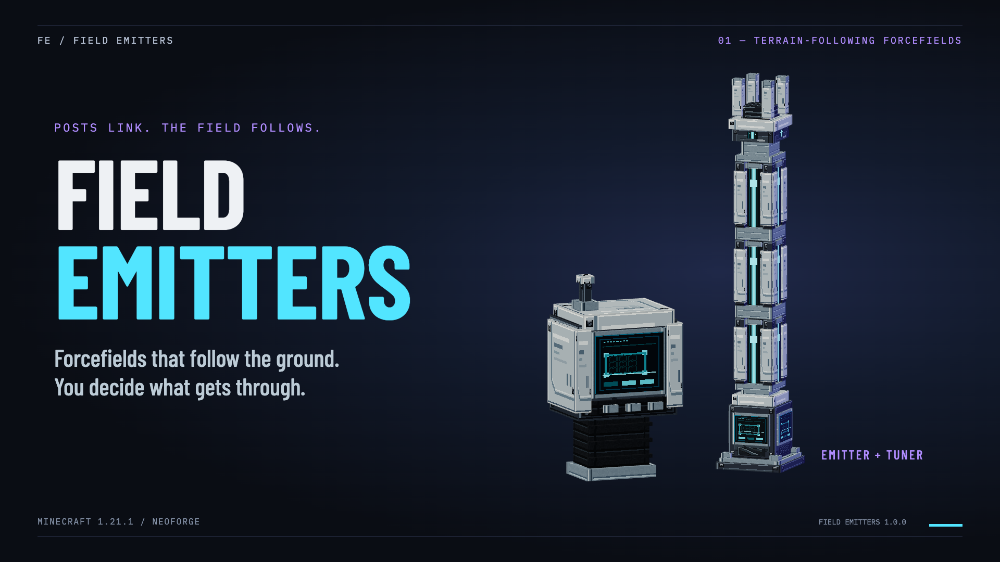
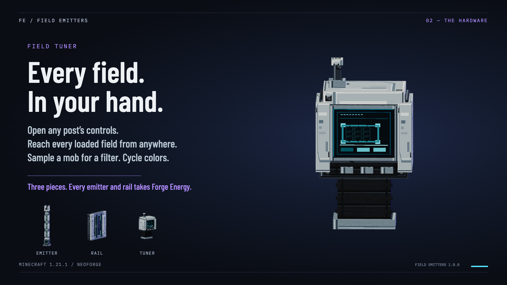
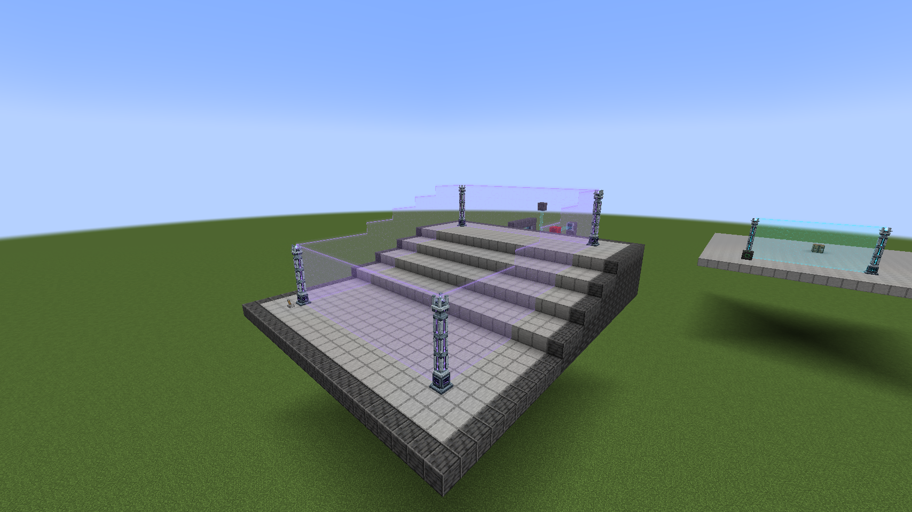

# Field Emitters showcase

**[Watch on YouTube](https://youtu.be/HvTZJLOWlAM)** · [Download the MP4](field-emitters-showcase.mp4) — 30 seconds, 1920 × 1080, 30 fps, H.264 MP4 without a soundtrack.

Published on [ZeroTheAbsolute](https://www.youtube.com/@zerotheabsolute) on September 11, 2026, with the poster above as its thumbnail. The video is also embedded in CurseForge's gallery and Modrinth's description. [Upload record](../publishing/youtube-upload.md).

## Presentation images

These 1920 × 1080 images share the video's dark steel, cyan and violet treatment. Use them for the README, project announcements, thumbnails or a mod listing.

| Image | Content |
|---|---|
| [Showcase poster](showcase-poster.png) | Title, turning emitter post and tuner |
| [Hardware](hardware.png) | Tuner close-up with the emitter, rail and tuner side by side |
| [Perimeter by day](perimeter-day.png) | Four posts on a hillside and the 20-block link range |
| [Perimeter at night](perimeter-night.png) | The same perimeter after dark |
| [Rails](rails.png) | Rails sealing a doorway, a shaft and a walkway |
| [Blocking filters](blocking-filters.png) | The Blocking tab |
| [Detection output](detection-output.png) | The Detection tab |

## In-game screenshots

Native Minecraft captures of Field Emitters 1.0.0, taken September 11, 2026 at 1708 × 960. The PNGs in [docs/publishing/gallery](../publishing/gallery/) preserve the original capture bytes; the video and the platform galleries use them unchanged.

| Screenshot | What it shows |
|---|---|
| [Linked posts](../publishing/gallery/gallery-post-closeup.png) | Two posts, the energy cube feeding the near one and the field between them |
| [Posts at night](../publishing/gallery/gallery-post-night.png) | The same posts after dark, with the field glowing and the energy channels lit |
| [Perimeter overview](../publishing/gallery/gallery-perimeter-day.png) | Four posts around a stepped hillside by day |
| [Perimeter at night](../publishing/gallery/gallery-perimeter-night-close.png) | The hillside perimeter after dark in the violet preset |
| [Blocking at night](../publishing/gallery/gallery-impact-night-1.png) | A zombie held inside the lit perimeter at midnight |
| [Rails](../publishing/gallery/gallery-rails-doorway.png) | Rails sealing a doorway, a shaft and a walkway; the lamp shows a detection pulse |
| [Blocking filters](../publishing/gallery/gui-blocking.png) | Category toggles, age and owner rules, type, item, UUID and tag fields, and directions |
| [Detection output](../publishing/gallery/gui-detection.png) | Pulse or steady output and per-stack or per-item counting |
| [Field Manager](../publishing/gallery/gui-manager.png) | Every loaded field in the dimension, reachable from the tuner |
| [Emitter recipe](../publishing/gallery/craft-emitter.png) | The Field Emitter recipe in the crafting table |

## Source and editing

The captured release is `field-emitters-1.0.0.jar`, SHA-256 `029ba534a36c51c5cbe4d08769b4409fb156efba530ec3c46be149a6b9ff5fd9`, built from tag `v1.0.0` at `c1b8112`.

The video combines the native captures with animated framing and typography. Its turning post, rail and tuner views render the repository's model JSON and textures with studio lighting, including the animated energy and display strips at their `.mcmeta` frame rates and the default cyan field tint. The separate in-game field renderer appears only in the captures. The mod ships no sound assets, so the video has no soundtrack. Typography uses Barlow Condensed and IBM Plex Mono through the pinned Remotion font package.

[sources.json](sources.json) maps the inputs to their source paths and SHA-256 values. [render-manifest.json](render-manifest.json) identifies the exported video and presentation images. See [the editable Remotion project](../../tools/showcase/README.md) to change timing, copy, camera angles or captures. Video production is separate from the mod build and does not modify or launch Minecraft.
